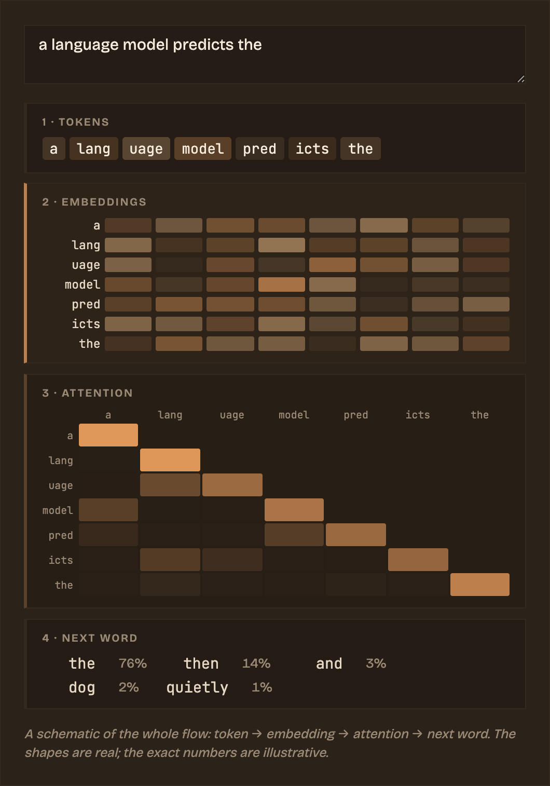

### Hi, I'm Oliveaniss

I build **explorable explanations** for how modern AI works — pages you can poke at instead of equations you have to take on faith. Tokens, embeddings, attention, sampling, training: each one becomes a live widget you can type into, drag, or watch run.

Most of my work lives in one place:

## [Explorable AI](https://my-web-seven-brown-60.vercel.app)

An interactive garden about how language models actually think.

  

A few things you can do there:

- Type a sentence and watch the whole model run, stage by stage — tokens, embeddings, attention, and its guess at the next word.
- Drag a temperature slider and see the next-word odds slide from confident to chaotic.
- Ask a question and have an embedding model, running entirely in your browser, surface the notes closest in meaning.

Set in warm, two-ink palettes that turn from oat-milk day to deep-espresso night, and built on a heavily customized Quartz.

**[Wander the garden →](https://my-web-seven-brown-60.vercel.app)**
